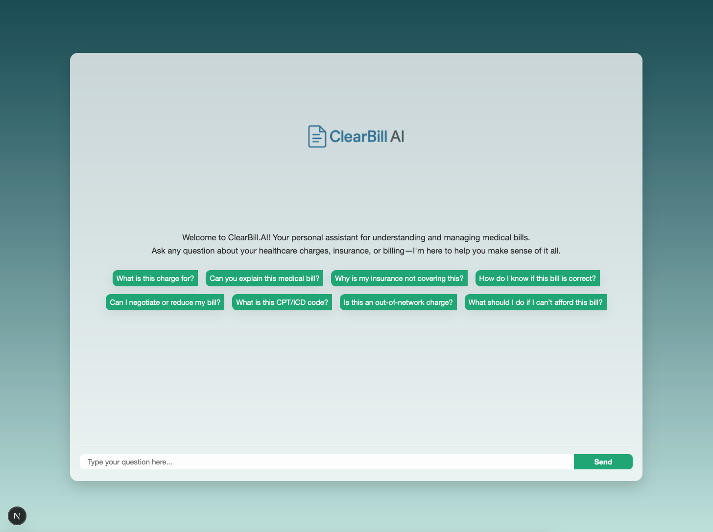
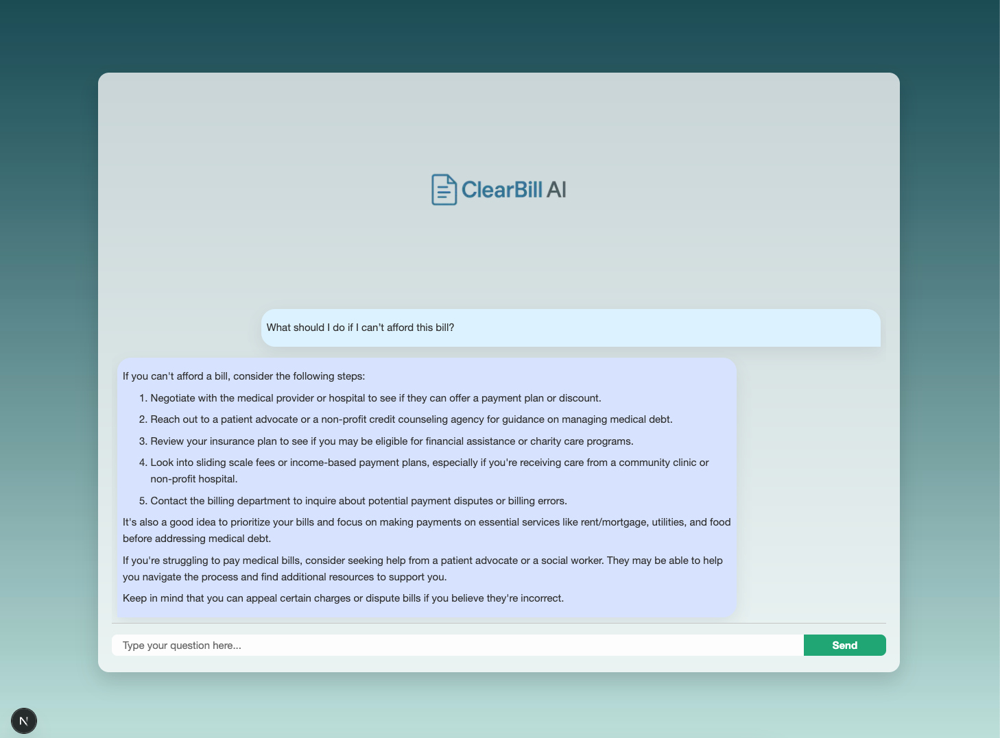

# ClearBill.AI

[](https://github.com/ethanvillalovoz/clearbill-ai/actions/workflows/ci.yml)


ClearBill.AI is a medical bill explainer built with Next.js, Astra DB vector search, local embeddings, and a Hugging Face-hosted Llama model. It uses retrieval-augmented generation to answer questions about billing language, insurance terms, healthcare charges, and common patient billing workflows.

> ClearBill.AI is an educational project, not medical, legal, insurance, or financial advice. Do not upload real patient health information or sensitive billing records unless you have reviewed the deployment, data handling, and compliance requirements for your use case.

## Screenshots




## What It Does

- Answers user questions through a chat interface focused on medical bills and insurance terminology.
- Retrieves relevant healthcare billing context from an Astra DB vector collection.
- Generates local query embeddings with `@huggingface/transformers`.
- Calls the Hugging Face chat completions router with `meta-llama/Llama-3.1-8B-Instruct:nebius`.
- Renders assistant responses with Markdown support for clearer explanations.

## Tech Stack

- **Framework:** Next.js, React, TypeScript
- **Retrieval:** Astra DB vector search
- **Embeddings:** `@huggingface/transformers`
- **LLM:** Hugging Face chat completions router
- **Data ingestion:** Puppeteer, local text chunking
- **UI rendering:** `react-markdown`

## Architecture

```text
Healthcare source URLs
        |
        v
scripts/loadDB.ts
        |
        v
Puppeteer scrape -> local text chunks -> local embeddings -> Astra DB vector collection
        |
        v
User question -> local query embedding -> vector search -> retrieved context
        |
        v
Hugging Face chat completion -> Markdown response -> Next.js chat UI
```

## Repository Layout

```text
.
├── docs/                    # Screenshots and project documentation
├── nextjs-clearbill-ai/      # Next.js application
│   ├── app/                  # App Router pages, components, and API route
│   ├── scripts/loadDB.ts     # Data loading script for Astra DB
│   └── .env.example          # Required environment variables
├── .github/                  # CI, issue templates, and PR template
├── CONTRIBUTING.md
├── LICENSE
└── README.md
```

## Prerequisites

- Node.js 20+
- npm
- Astra DB serverless vector database
- Hugging Face account and API token

## Quick Start

1. Clone the repository.

   ```sh
   git clone https://github.com/ethanvillalovoz/clearbill-ai.git
   cd clearbill-ai/nextjs-clearbill-ai
   ```

2. Install dependencies.

   ```sh
   npm ci
   ```

3. Create your local environment file.

   ```sh
   cp .env.example .env
   ```

4. Fill in `.env`.

   ```env
   ASTRA_DB_NAMESPACE=your_astra_db_keyspace
   ASTRA_DB_COLLECTION=your_astra_db_collection
   ASTRA_DB_API_ENDPOINT=your_astra_db_api_endpoint
   ASTRA_DB_APPLICATION_TOKEN=your_astra_db_application_token
   HUGGINGFACE_API_TOKEN=your_hugging_face_api_token
   ```

5. Seed Astra DB with source content.

   ```sh
   npm run browsers:install
   npm run seed
   ```

6. Start the development server.

   ```sh
   npm run dev
   ```

7. Open [http://localhost:3000](http://localhost:3000).

## Astra DB Setup

1. Create a serverless vector database in [Astra DB](https://astra.datastax.com).
2. Create or choose a keyspace for ClearBill.AI.
3. Copy the API endpoint and application token from the Astra DB connection settings.
4. Set `ASTRA_DB_COLLECTION` to the collection name you want the seed script to create/use.

The seed script creates a vector collection configured for the local embedding model and inserts scraped content chunks with their embeddings.

## Data Loading

The loader lives at `nextjs-clearbill-ai/scripts/loadDB.ts`.

To change the source corpus, update the `clearbillData` URL array in that file, then run:

```sh
npm run browsers:install
npm run seed
```

The browser install step is only needed before the first seed run or when you want Puppeteer to refresh its local browser binary. The loader scrapes each URL, splits the page text into overlapping chunks, embeds each chunk, and inserts the result into Astra DB.

## Scripts

Run these commands from `nextjs-clearbill-ai/`.

| Command | Description |
| --- | --- |
| `npm run dev` | Start the local Next.js dev server |
| `npm run build` | Build the production app |
| `npm run start` | Start the production build |
| `npm run browsers:install` | Install the local browser binary used by Puppeteer |
| `npm run lint` | Run ESLint |
| `npm run typecheck` | Run TypeScript checks |
| `npm test` | Alias for `npm run typecheck` |
| `npm run seed` | Scrape, embed, and load content into Astra DB |

## Contributing

Contributions are welcome. Please read [CONTRIBUTING.md](CONTRIBUTING.md) before opening an issue or pull request.

## Security

Please do not commit secrets, tokens, `.env` files, real medical bills, or protected health information. See [SECURITY.md](SECURITY.md) for responsible disclosure guidance.

## License

This project is licensed under the Apache License 2.0. See [LICENSE](LICENSE) for details.
