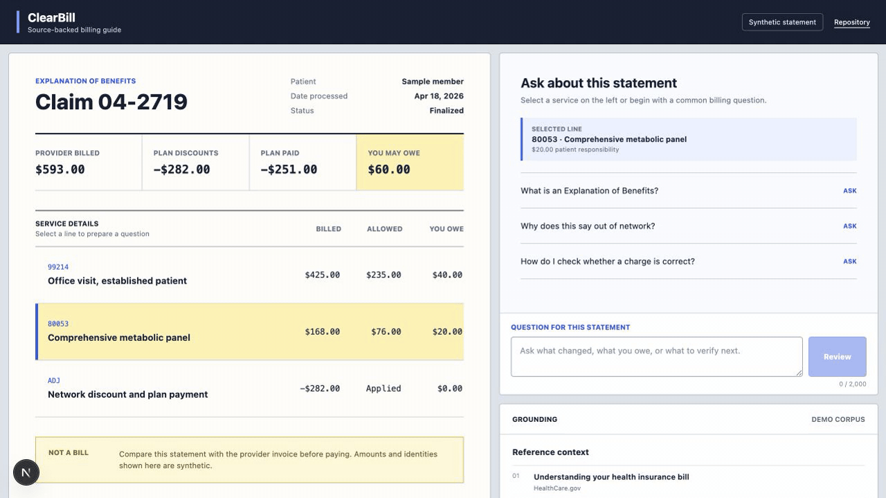
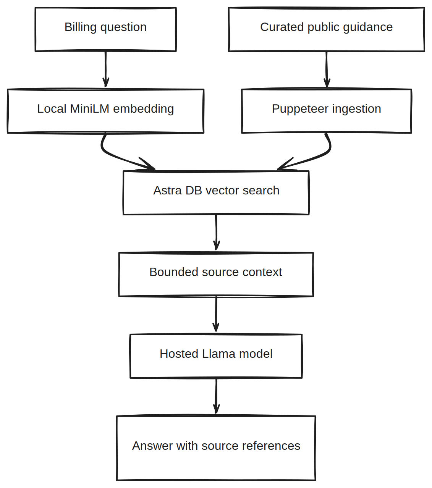

# ClearBill

ClearBill opens on one line item from a synthetic explanation of benefits. It puts the provider charge, plan discount, insurer payment, and patient balance next to the public guidance used to explain them.

[](https://github.com/ethanvillalovoz/clearbill/actions/workflows/ci.yml)
[](LICENSE)

[](docs/media/clearbill-demo.mp4)

The recording moves through one synthetic statement. Pick a service, check the arithmetic, and inspect the cited guidance. [Watch the MP4](docs/media/clearbill-demo.mp4) or open the [poster frame](docs/media/clearbill-poster.webp).

> ClearBill is an educational project, not medical, legal, insurance, or financial advice. Do not enter protected health information, member IDs, account numbers, diagnoses, or real billing records.

## Product

ClearBill separates the answer from its grounding. The conversation explains a term or next verification step; the adjacent source panel shows the public guidance used and keeps the tool's boundaries visible.

The default build is a deterministic demo that works without credentials. Live mode embeds a bounded question, retrieves matching passages from Astra DB, and asks a hosted Llama model to answer strictly from that context. If retrieval returns no usable evidence, the API declines to generate an answer.

## Architecture

[](docs/media/architecture.excalidraw)

Open the image for the editable Excalidraw source.

| Layer | Responsibility |
| --- | --- |
| Next.js + React | Billing workspace, deterministic demo, source inspection, and safe error states |
| Route handler | Payload validation, retrieval orchestration, context-only prompt, and bounded timeout |
| Astra DB | Vector search over curated public healthcare billing guidance |
| Transformers.js | Local `all-MiniLM-L6-v2` query and corpus embeddings |
| Hugging Face router | Low-temperature answer generation from retrieved context only |

## Run The Demo

```bash
cd nextjs-clearbill-ai
npm ci
npm run dev
```

Open [http://localhost:3000](http://localhost:3000). The interface labels the demo corpus and never represents fixture answers as live retrieval.

## Run Live Retrieval

1. Copy the environment template.

   ```bash
   cp .env.example .env.local
   ```

2. Set `NEXT_PUBLIC_CLEARBILL_MODE=live` and configure Astra DB plus a Hugging Face token.

3. Install the Puppeteer browser and seed the vector collection.

   ```bash
   npm run browsers:install
   npm run seed
   ```

4. Start the app with `npm run dev`.

The seed process reuses one browser session, stores source title and publisher metadata with every chunk, and closes the browser even when a source fails.

## Environment

| Variable | Purpose |
| --- | --- |
| `NEXT_PUBLIC_CLEARBILL_MODE` | `demo` by default; set to `live` to call `/api/chat` |
| `ASTRA_DB_NAMESPACE` | Astra DB keyspace |
| `ASTRA_DB_COLLECTION` | Vector collection name |
| `ASTRA_DB_API_ENDPOINT` | Astra DB API endpoint |
| `ASTRA_DB_APPLICATION_TOKEN` | Server-side Astra DB token |
| `HUGGINGFACE_API_TOKEN` | Server-side model router token |
| `HUGGINGFACE_CHAT_MODEL` | Optional hosted chat model override |

Only `NEXT_PUBLIC_CLEARBILL_MODE` is exposed to the browser. All credentials remain server-side.

## Safety Contract

- Requests contain 1-20 messages; each message is limited to 2,000 characters.
- Only `user` and `assistant` roles are accepted from the client.
- The model receives up to six retrieved passages and a context-only system prompt.
- No answer is generated when retrieval produces no usable text.
- Model calls time out after 25 seconds and upstream response bodies are not exposed publicly.
- Markdown renders without raw HTML, and external links open with `rel="noreferrer"`.

These controls reduce obvious failure modes; they do not make this project HIPAA compliant or suitable for processing real patient data.

## Repository Map

```text
nextjs-clearbill-ai/app/             product interface and route handler
nextjs-clearbill-ai/app/lib/         validation, source, and prompt contracts
nextjs-clearbill-ai/app/data/        deterministic public demo fixtures
nextjs-clearbill-ai/scripts/loadDB.ts corpus ingestion and embedding pipeline
docs/media/                           verified interaction capture and poster
```

The application icon is from Lucide; its license is reproduced in [THIRD_PARTY_NOTICES.md](THIRD_PARTY_NOTICES.md).

## Verification

```bash
cd nextjs-clearbill-ai
npm run check
```

The check runs ESLint, TypeScript, six focused tests, and a production Next.js build. CI executes the same contract on every pull request.

## Limitations

- Billing rules and consumer protections vary by plan, jurisdiction, service date, and provider.
- Public web guidance can change after the vector collection is seeded.
- Retrieval relevance is not a guarantee that a generated explanation is correct.
- ClearBill does not parse uploaded bills, determine coverage, or adjudicate disputes.

## License

Licensed under the [Apache License 2.0](LICENSE).
